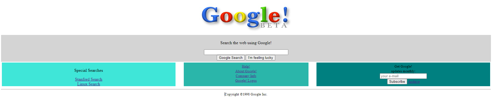

# 1998 Google Clone

### Google was founded in 1996 and published its first version in 1998. There is a web archive named [Wayback Machine](https://archive.org/web/) you can view all the websites of the past on the Internet. I tried to implement 1998 version of Google to test and enhance my skills in HTML. The buttons are not working at the moment, I'm planning to add those features after I learn more about web development. 

### Also, if you are fluent in Turkish, I enjoyed learning HTML with [Kodluyoruz](https://www.patika.dev/egitimler/frontend-web-development-patikasi/html). I'd say check their content out.

### Here is the home page looking:
